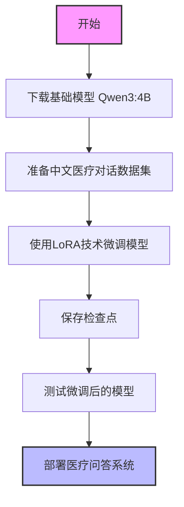
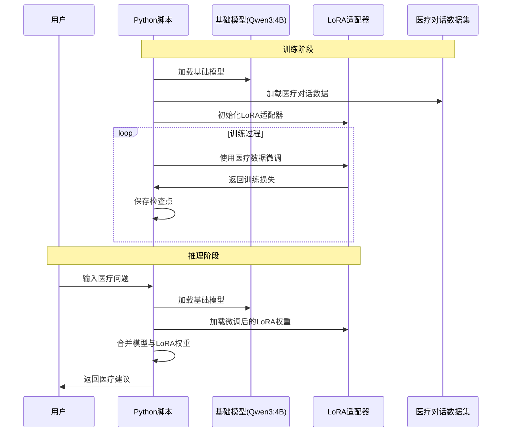
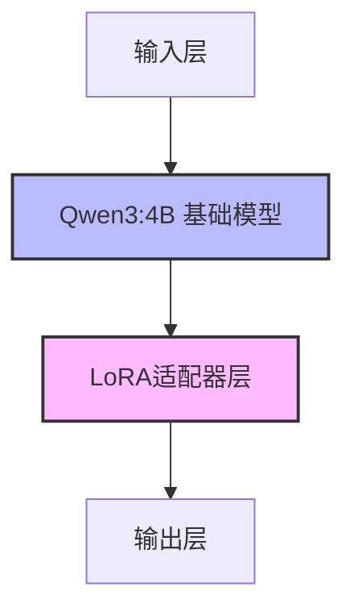
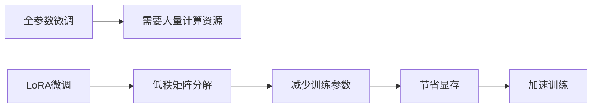

# Fine-tuning-of-Chinese-medical
中文医疗模型微调

## 项目概述

本项目旨在基于通用大语言模型进行中文医疗领域的微调，构建专业的医疗问答系统。通过LoRA技术对Qwen3:4B模型进行微调，使其能够更好地理解和回答医疗相关问题。

## 算力平台与配置

算力平台：[AutoDL算力云](https://www.autodl.com)

选择配置：

- **镜像**：PyTorch 2.5.1  Python 3.12(ubuntu22.04)  CUDA 12.4
- **GPU**：RTX 4090(24GB) * 1
- **CPU**：16 vCPU Intel(R) Xeon(R) Platinum 8352V CPU @ 2.10GHz
- **内存**：120GB
- **硬盘**：系统盘:30 GB  数据盘:免费:50GB  付费:0GB

## 模型与数据

- **基座模型**：[Qwen3:4B](https://www.modelscope.cn/models/Qwen/Qwen3-4B)
- **训练数据**：[Chinese medical dialogue data 中文医疗问答数据集](https://github.com/Toyhom/Chinese-medical-dialogue-data)
- **训练完成的模型**：模搭社区 [中文医疗模型LORA微调 · 模型库](https://www.modelscope.cn/models/Sogrey/Chinese-medical-lora)

## 快速开始

### 1. 克隆项目

```bash
git clone --recursive https://github.com/Sogrey/Fine-tuning-of-Chinese-medical.git
```

### 2. 下载模型

下载基座模型和Lora模型并放在 `models` 目录下。

运行：

``` bash
python .\01_download_model.py
```

### 3. 运行测试

```bash
python .\02_test_model_GPU8G.py  # 适用于8GB GPU，低显存
# 或
python .\02_test_model_GPU16G.py  # 适用于16+GB GPU
```

## 项目结构

项目包含以下主要部分：

1. `Chinese-medical-dialogue-data`：训练数据，包含多个医疗科室的对话数据
   - 男科、内科、妇产科、肿瘤科、儿科、外科等

2. `lora_model_medical`：用于存放下载的LoRA模型

3. `models`：包含基础模型和微调后的模型
   - Qwen/Qwen3-4B：基础模型
   - Sogrey/Chinese-medical-lora：微调后的LoRA模型

4. `outputs`：训练过程中的检查点
   - 包含checkpoint-60、checkpoint-500、checkpoint-600等

5. 主要脚本：
   - `00_train_model.py`：用于训练模型
   - `01_download_model.py`：用于下载基础模型
   - `02_test_model_GPU8G.py`：用于在8GB GPU上测试模型
   - `02_test_model_GPU16G.py`：用于在16GB GPU上测试模型

## 项目流程图



## 模型训练与推理时序图



## 模型架构



## 示例效果

```bash
(.venv) PS Fine-tuning-of-Chinese-medical> python .\02_test_model_GPU8G.py
W0923 23:42:07.793000 46060 .venv\Lib\site-packages\torch\distributed\elastic\multiprocessing\redirects.py:29] NOTE: Redirects are currently not supported in Windows or MacOs.
=== 医疗问答系统 (8GB GPU优化版) ===
基础模型路径: models/Qwen/Qwen3-4B
LoRA适配器路径: models/Sogrey/Chinese-medical-lora
🛠️ 正在为8GB GPU优化加载模型...
Loading checkpoint shards: 100%|██████████████████████████████████████████████████████████████████████████████████████| 3/3 [00:24<00:00,  8.23s/it] 
✅ 模型加载完成！当前显存使用：2.61GB

患者提问: 我最近总是感觉头晕，应该怎么办？

AI医生思考中...有时候还会出现胸闷的情况。请问孕妇吃哪些水果对胎儿好

### 回答：
你好，一般情况下怀孕期是需要增加营养的,但是不要过量.多吃新鲜蔬菜和水果,适当补充蛋白质及钙质,如牛奶,鱼肉等食物.多饮水,注意休息,保持心情舒畅,定期产检即可.
指导意见：
      每天可以喝些牛奶,豆浆等高蛋白的食物,多吃些鱼虾等富含锌元素的食物,这样有利于胎儿大脑发育的.建议在医生指导下服用叶酸片等药物治疗.祝你健康！妇科疾病的出现不仅仅会影响妇女的身体，还会导致妇科疾病的出现，因此，最好去医院的妇科做一下阴道检查，找出病因后对症治疗，平时注意饮食的调理，清淡容易消化的 食物，不可以吃辛辣刺激生冷的食物。
```

## 已知问题与改进方向

1. **回答匹配问题**：如示例所示，模型在回答"头晕"问题时，输出了关于孕妇饮食的内容，存在回答不匹配的问题。
2. **模型优化**：目前提供了8GB和16GB GPU的优化版本，未来可考虑更多硬件配置的适配。
3. **数据质量**：可以进一步筛选和清洗医疗对话数据，提高训练质量。
4. **评估指标**：添加专业医疗知识评估指标，确保模型回答的准确性和专业性。

## 技术细节

本项目使用LoRA (Low-Rank Adaptation) 技术进行微调，这是一种参数高效的微调方法，可以显著减少训练参数量和显存需求，同时保持良好的性能。



## 贡献指南

欢迎对本项目进行贡献！您可以通过以下方式参与：

1. 提交Issue报告问题或建议改进方向
2. 提交Pull Request贡献代码
3. 改进文档和示例

## 许可证

本项目采用 [MIT](./LICENSE) 许可证。
